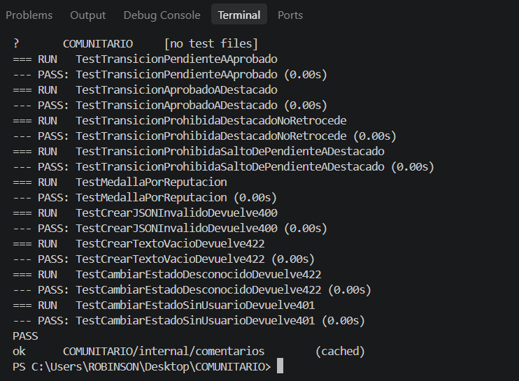
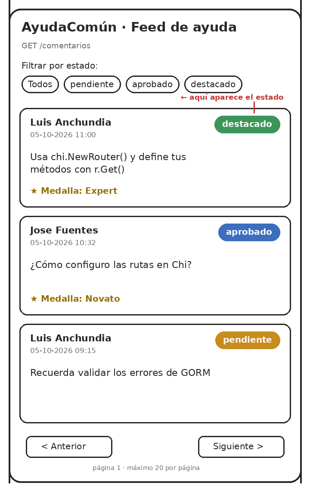
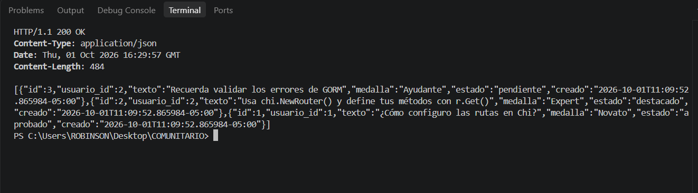
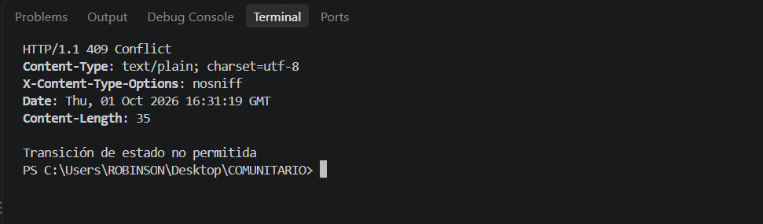

# Hito 1 · Addendum técnico

**Pareja:** Robinson Benitez · Alexander Lazaro
**Paralelo:** Aplicaciones Web II A

## A. Estructura del proyecto

```
.
├── main.go                      # Arranque: lee .env, conecta a PostgreSQL, migra, siembra datos y registra las rutas con chi
├── go.mod                       # Módulo COMUNITARIO y dependencias (chi, GORM, driver de PostgreSQL, godotenv)
├── go.sum                       # Sumas de verificación de las dependencias
├── .env.example                 # Variables de entorno de ejemplo, sin datos reales
├── .gitignore                   # Excluye .env para no subir credenciales
├── README.md                    # Descripción del proyecto
├── internal/
│   └── comentarios/
│       ├── modelos.go           # Structs Negocio, Usuario y Comentario; constantes de estados y roles
│       ├── reglas.go            # Máquina de estados (TransicionPermitida) y medalla según reputación
│       ├── manejadores.go       # Los seis endpoints HTTP
│       ├── semilla.go           # Datos iniciales: un negocio, un miembro y un moderador
│       └── comentarios_test.go  # Pruebas del paquete
└── docs/                        # Ficha, addendum, presentación, diagramas y capturas del Hito 1
```

## B. Configuración y secretos

| Variable | Para qué sirve | Ejemplo (sin datos reales) |
|----------|----------------|----------------------------|
| DB_HOST | Servidor de PostgreSQL | localhost |
| DB_PORT | Puerto de PostgreSQL | 5432 |
| DB_USER | Usuario de la base de datos | postgres |
| DB_PASSWORD | Contraseña de la base de datos | cambiar_esta_clave |
| DB_NAME | Nombre de la base de datos | APP-COMUNITARIA |
| PORT | Puerto donde escucha el servidor (por defecto 8080) | 8080 |

**Archivo de ejemplo:** `.env.example` en la raíz del repositorio. El archivo `.env` con los valores reales está en `.gitignore` y no se sube. `main.go` lo carga con `godotenv` y ya no contiene ninguna credencial.

## C. Pruebas

Son 9 pruebas en `internal/comentarios/comentarios_test.go`. Las cuatro primeras cubren la máquina de estados, la quinta la medalla y las demás las validaciones del servidor, que ocurren antes de consultar la base de datos.

| Prueba | Qué caso cubre |
|--------|----------------|
| TestTransicionPendienteAAprobado | Permite pasar de pendiente a aprobado. |
| TestTransicionAprobadoADestacado | Permite pasar de aprobado a destacado. |
| TestTransicionProhibidaDestacadoNoRetrocede | Prohíbe volver de destacado a aprobado o a pendiente (evita sumar reputación varias veces). |
| TestTransicionProhibidaSaltoDePendienteADestacado | Prohíbe saltar de pendiente a destacado sin aprobar. |
| TestMedallaPorReputacion | Novato por debajo de 25 puntos, Ayudante de 25 a 49 y Expert desde 50. |
| TestCrearJSONInvalidoDevuelve400 | POST /comentarios con JSON mal formado responde 400. |
| TestCrearTextoVacioDevuelve422 | POST /comentarios con texto vacío responde 422. |
| TestCambiarEstadoDesconocidoDevuelve422 | PATCH con un estado que no existe responde 422. |
| TestCambiarEstadoSinUsuarioDevuelve401 | PATCH sin la cabecera X-Usuario-ID responde 401. |

**Captura de `go test ./...`:** 

## D. Boceto de la pantalla principal

La pantalla principal es el **Feed de ayuda**, que consume `GET /comentarios`. Cada tarjeta muestra el texto del comentario, el autor, la fecha y el estado (pendiente, aprobado o destacado) como una etiqueta de color en la esquina superior derecha; los comentarios destacados llevan además la medalla del autor. Arriba hay un filtro por estado y abajo los botones de página anterior y siguiente.



## E. Diagrama de secuencia del caso de uso principal

Caso: un moderador destaca un comentario aprobado, y el autor gana reputación y una medalla.

```mermaid
sequenceDiagram
    actor Moderador
    participant Bandeja as Bandeja de moderación
    participant API
    participant BD as PostgreSQL
    Moderador->>Bandeja: toca "Destacar" en un comentario aprobado
    Bandeja->>API: PATCH /comentarios/310/estado {"estado":"destacado"} con X-Usuario-ID: 2
    API->>BD: busca al usuario 2 y al comentario 310
    BD-->>API: rol moderador; comentario en estado aprobado
    API->>API: valida la transición aprobado a destacado
    API->>BD: transacción: autor +10 de reputación, medalla y estado destacado
    BD-->>API: ok
    API-->>Bandeja: 200 con el comentario actualizado
    Bandeja-->>Moderador: muestra el comentario destacado con su medalla
```

## F. Capturas de respuestas

**Caso correcto:** 

**Caso con error de validación:** 


## G. Cómo ejecutar el proyecto

1. Copiar `.env.example` a `.env` y poner la contraseña de PostgreSQL.
2. Ejecutar `go run main.go -reset` la primera vez, para crear las tablas y los datos de ejemplo.
3. Ejecutar `go test ./... -v` para correr las pruebas.