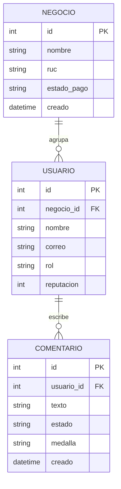
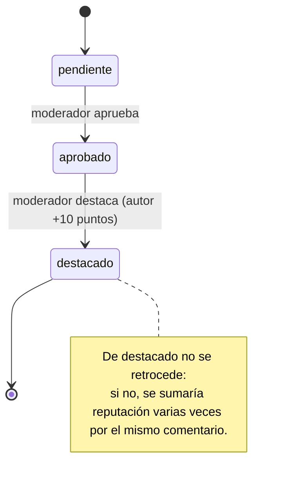

# Hito 1 · Ficha del negocio

**Pareja:** Robinson Benitez · Alexander Lazaro
**Paralelo:** Aplicaciones Web II A
**Negocio en una línea:** AyudaComún es una plataforma de soporte comunitario donde los clientes de un negocio ecuatoriano (tienda en línea o software) se ayudan entre sí, ganan puntos, reputación y medallas digitales, y el negocio paga una suscripción mensual por su comunidad.

## 1. Negocio de referencia

**StartupTalky** (fundador Shubham Kumar, Bangalore, India; activo desde junio 2018) es una comunidad y medio para emprendedores. Empezó con grupos de Facebook, uno de ellos con 100 mil miembros, y creció hasta un sitio web con más de un millón de visitas al mes. A los miembros no les vende nada: tienen contenido y conversación gratis, y el dinero llega de terceros. Sus ingresos vienen de afiliados, Google AdSense, alianzas con marcas y servicios de link-building para otras marcas y agencias. El fundador declara unos 10.000 dólares de ingresos al mes, 99 dólares de costo inicial, un fundador y 13 empleados. Como en todos los casos de Starter Story, estas cifras las declara el propio fundador y nadie las audita. Tomamos de este caso que el valor está en una comunidad activa. Lo que cambiamos es quién paga: en lugar de publicidad y afiliados, AyudaComún cobra una suscripción mensual al negocio dueño de la comunidad, y sus clientes participan sin pagar.

**Enlace:** https://www.starterstory.com/stories/startuptalky

## 2. Caso de contraste

**Yahoo Answers** (cerró el 4 de mayo de 2021) era una comunidad gratuita de preguntas y respuestas donde los usuarios ganaban puntos y niveles por participar. Es comparable a nuestra idea: ayuda entre usuarios más un sistema de puntos. Nuestra hipótesis es que fracasó por una diferencia de fondo en los incentivos y en quién paga la moderación. Los puntos premiaban la cantidad de respuestas, así que había quien respondía sin saber solo para sumar. Además el servicio era gratuito y no tenía un ingreso propio que financiara moderar a esa escala: la calidad cayó, los usuarios expertos se fueron a foros especializados y la comunidad se degradó. En AyudaComún un comentario nace pendiente y solo gana reputación cuando un moderador lo destaca, nunca por publicar, y la suscripción del negocio financia a su propio moderador.

**Fuente:** https://technical.ly/software-development/yahoo-answers-shutdown/ · https://www.lenovys.com/en/blog/yahooanswers-shuts-down/

## 3. Adaptación al Ecuador

1. **Pago por transferencia o depósito.** Los negocios pequeños ecuatorianos suelen pagar enviando la foto del comprobante, no con tarjeta recurrente. Por eso la suscripción no se activa sola: el negocio queda en `pago_por_verificar` hasta que el equipo de la plataforma confirma el pago, y mientras no esté `activa` no puede publicar comentarios nuevos.
2. **Datos móviles limitados y conexión irregular fuera de las ciudades grandes** (por ejemplo, en cantones de Manabí). Muchos clientes entran desde el celular con plan prepago. Por eso el listado va paginado (máximo 20 comentarios por página, el servidor rechaza más), sin imágenes ni adjuntos.
3. **Facturación electrónica del SRI.** El negocio que contrata necesita RUC (muchos están en RIMPE) y espera una factura por cada mensualidad. Por eso `Negocio` guarda el RUC como dato obligatorio de 13 caracteres.

**Qué cambió en el modelo por estas restricciones:** por la restricción 1 agregamos a `Negocio` el atributo `estado_pago` (uno de: pago_por_verificar, activa, vencida), y el servidor solo acepta comentarios nuevos de una comunidad cuando el estado de pago de su negocio es `activa`; si no, responde 403.

## 4. Modelo de datos

### Entidad: Negocio

| Atributo | Tipo | Obligatorio | Ejemplo |
|----------|------|-------------|---------|
| id | número entero | sí | 1 |
| nombre | texto | sí | Tienda Manta Tech |
| ruc | texto | sí | 1391234567001 |
| estado_pago | uno de: pago_por_verificar, activa, vencida | sí | pago_por_verificar |
| creado | fecha y hora | sí | 01-10-2026 09:15 |

### Entidad: Usuario

| Atributo | Tipo | Obligatorio | Ejemplo |
|----------|------|-------------|---------|
| id | número entero | sí | 2 |
| negocio | referencia a Negocio | sí | 1 |
| nombre | texto | sí | Luis Anchundia |
| correo | texto | sí | luis@ejemplo.ec |
| rol | uno de: miembro, moderador | sí | moderador |
| reputacion | número entero | sí | 50 |

### Entidad: Comentario

| Atributo | Tipo | Obligatorio | Ejemplo |
|----------|------|-------------|---------|
| id | número entero | sí | 310 |
| usuario | referencia a Usuario (autor) | sí | 1 |
| texto | texto | sí | Borra la caché de la app y vuelve a entrar. |
| estado | uno de: pendiente, aprobado, destacado | sí | pendiente |
| medalla | uno de: Novato, Ayudante, Expert (vacío hasta ser destacado) | no | Ayudante |
| creado | fecha y hora | sí | 05-10-2026 11:00 |

### Relaciones

| Entidades | Cardinalidad | Frase |
|-----------|--------------|-------|
| Negocio — Usuario | 1—N | Un negocio agrupa a muchos usuarios; cada usuario pertenece a un solo negocio. |
| Usuario — Comentario | 1—N | Un usuario escribe muchos comentarios; cada comentario tiene un solo autor. |

### Structs en Go

Están en `internal/comentarios/modelos.go`:

```go
type Negocio struct {
	ID         uint      `gorm:"primaryKey" json:"id"`
	Nombre     string    `gorm:"not null" json:"nombre"`
	RUC        string    `gorm:"not null;size:13" json:"ruc"`
	EstadoPago string    `gorm:"not null;default:pago_por_verificar" json:"estado_pago"`
	Creado     time.Time `json:"creado"`
}

type Usuario struct {
	ID          uint         `gorm:"primaryKey" json:"id"`
	NegocioID   uint         `gorm:"not null;index" json:"negocio_id"`
	Nombre      string       `gorm:"not null" json:"nombre"`
	Correo      string       `gorm:"not null" json:"correo"`
	Rol         string       `gorm:"not null;default:miembro" json:"rol"`
	Reputacion  int          `gorm:"not null;default:0" json:"reputacion"`
	Comentarios []Comentario `json:"comentarios,omitempty"`
}

type Comentario struct {
	ID        uint      `gorm:"primaryKey" json:"id"`
	UsuarioID uint      `gorm:"not null;index" json:"usuario_id"`
	Texto     string    `gorm:"not null" json:"texto"`
	Medalla   string    `json:"medalla"`
	Estado    string    `gorm:"not null;default:pendiente" json:"estado"`
	Creado    time.Time `json:"creado"`
}
```

Los valores cerrados (`estado`, `rol`, `estado_pago`) son constantes en Go; el `estado` se valida con el mapa `estadosValidos` y las transiciones con `TransicionPermitida` (`reglas.go`).

**Decisión de tipos que tuvimos que pensar:** `Creado` es `time.Time` y no texto, para poder ordenar los comentarios (el listado va del más nuevo al más viejo) y saber cuándo se publicó cada uno. `Reputacion` es `int` y no `uint` porque es un puntaje que podría bajar en el futuro (por ejemplo, si un moderador sanciona a un usuario). `Estado` y `Rol` son `string` con constantes porque Go no tiene enumeraciones y así GORM los guarda como texto legible en PostgreSQL.

### Diagrama del modelo completo



**Decisión discutible del modelo y por qué la tomamos:** `Medalla` es un atributo de `Comentario` y no una entidad propia, porque en este hito la medalla se calcula a partir de la reputación del autor (menos de 25 puntos: Novato; 25 a 49: Ayudante; 50 o más: Expert) y no necesita fecha ni datos propios. Si más adelante las medallas tienen un catálogo editable por cada negocio, se convertiría en una entidad `Medalla` con una tabla de otorgamientos. Además, `Negocio` es una entidad aparte, y no un campo de `Usuario`, porque un negocio tiene muchos usuarios y es quien paga y tiene estado de pago.

## 5. Máquina de estados

**Entidad con estados:** Comentario

| Estado | Qué significa |
|--------|---------------|
| pendiente (inicial) | El comentario se publicó y espera revisión de un moderador. No suma reputación. |
| aprobado | Un moderador revisó que el comentario es correcto y respeta las normas. |
| destacado | Un moderador lo marcó como una ayuda valiosa: el autor gana 10 puntos de reputación y puede recibir una medalla. |

| De | A | Quién la hace | Condición |
|----|---|---------------|-----------|
| pendiente | aprobado | moderador | El comentario existe y está en estado pendiente. |
| aprobado | destacado | moderador | El comentario está en estado aprobado; el servidor suma 10 puntos al autor y le asigna su medalla. |

**Transición prohibida y por qué:** de `destacado` no se vuelve a `aprobado` ni a `pendiente`. Si se pudiera retroceder, un moderador podría volver a destacar el mismo comentario y sumar reputación varias veces por la misma ayuda, y la reputación (y las medallas) dejarían de significar algo. Tampoco se permite saltar de `pendiente` a `destacado`: todo comentario pasa primero por revisión. El servidor responde 409 cuando se intenta una transición no permitida.

### Diagrama de estados



## 6. Roles y permisos

| Acción | Miembro | Moderador |
|--------|---------|-----------|
| Ver comentarios y perfiles con reputación | todos | todos |
| Publicar un comentario | sí | sí |
| Pasar un comentario de pendiente a aprobado | no | todos |
| Pasar un comentario de aprobado a destacado | no | todos |
| Borrar un comentario | no | todos |

## 7. Mapa de endpoints por rol

| Endpoint | Rol que lo llama | Pantalla que lo consume | Qué devuelve | Qué valida | Código si falla |
|----------|------------------|-------------------------|--------------|------------|-----------------|
| GET /comentarios | miembro, moderador | Feed de ayuda | 200 con la lista paginada (más nuevos primero): id, texto, estado, medalla, usuario_id, creado | `estado` dentro de la lista cerrada; `page` y `limit` numéricos, `limit` máximo 20 | 400 |
| POST /comentarios | miembro, moderador | Nuevo comentario | 201 con el comentario creado en estado pendiente | JSON válido; texto no vacío; el usuario existe; el negocio tiene el pago `activa` | 400 (JSON), 422 (texto o usuario), 403 (negocio sin pago activo) |
| GET /comentarios/{id} | miembro, moderador | Detalle del comentario | 200 con el comentario | El comentario existe | 404 |
| PATCH /comentarios/{id}/estado | moderador | Bandeja de moderación | 200 con el comentario actualizado; si pasa a destacado, suma puntos y asigna medalla | Cabecera `X-Usuario-ID` de un usuario existente con rol moderador; estado de la lista cerrada; transición permitida | 400 (JSON), 422 (estado), 401 (sin usuario), 403 (no es moderador), 404, 409 (transición prohibida) |
| DELETE /comentarios/{id} | moderador | Bandeja de moderación | 204 sin cuerpo | Usuario moderador; el comentario existe | 401, 403, 404 |
| GET /usuarios | miembro, moderador | Perfil y ranking | 200 con los usuarios, su reputación y sus comentarios (con `Preload`, 2 consultas) | — | — |

### Matriz pantalla × endpoint

| Pantalla | GET /comentarios | POST /comentarios | GET /comentarios/{id} | PATCH /comentarios/{id}/estado | DELETE /comentarios/{id} | GET /usuarios |
|----------|------------------|-------------------|-----------------------|--------------------------------|--------------------------|---------------|
| Feed de ayuda (todos) | ✓ | | | | | |
| Nuevo comentario (todos) | | ✓ | | | | |
| Detalle del comentario (todos) | | | ✓ | | | |
| Bandeja de moderación (moderador) | ✓ | | | ✓ | ✓ | |
| Perfil y ranking (todos) | | | | | | ✓ |

**Endpoints que ya están funcionando y en qué archivo:** los seis, en `internal/comentarios/manejadores.go`, registrados en `main.go`. Las reglas de estados y medallas están en `internal/comentarios/reglas.go`.

## 8. Declaración de IA

Claude (Anthropic) para redactar el borrador de las secciones 1 a 7, los diagramas, el código de las reglas de estados, roles y pago, y el boceto de la pantalla principal; la pareja revisó, probó y ajustó el contenido.
